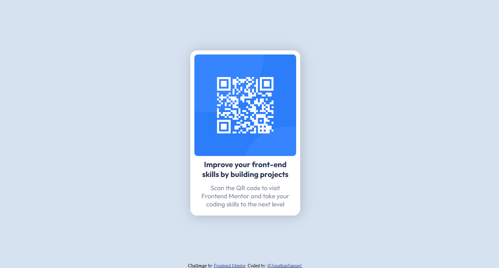

# Frontend Mentor - QR code component solution

This is a solution to the [QR code component challenge on Frontend Mentor](https://www.frontendmentor.io/challenges/qr-code-component-iux_sIO_H). Frontend Mentor challenges help you improve your coding skills by building realistic projects. 

## Table of contents

- [Overview](#overview)
  - [Screenshot](#screenshot)
  - [Links](#links)
- [My process](#my-process)
  - [Built with](#built-with)
  - [What I learned](#what-i-learned)
  - [Continued development](#continued-development)
- [Author](#author)


## Overview

My first challenge from Frontend Mentor. i'm very glad for the learning, mostly about the CSS.

### Screenshot



### Links

- Solution URL: [Repository GitHub](https://github.com/JonathanSamael/qr-code-component-main)
- Live Site URL: [Live site/ GitHub Pages](https://jonathansamael.github.io/qr-code-component-main/)

## My process

### Built with

- Semantic HTML5 markup
- CSS custom properties
- Flexbox

### What I learned

The most important learning for me its the use of proprieties of CSS style. Like, alignment, positions, flexbox, using rem (most time) insted of pixels (px).

```css 
main img {
    display: flex;
    border-style: 3px solid;
    border-radius: 8px;
    box-sizing: border-box;
    width: 15rem;
    height: 15rem;
}
```
```css footer
.attribution {
    font-size: 11px;
    margin-top: .5rem;
    position: absolute;
    bottom: 0;
    margin-left: 50%;
    transform: translateX(-50%);
}
```

### Continued development

Now, I'll learn more about _grid_ and the _flex_ property. Improve my skills to biggers challenges.
- Next step is JavaScripts!

## Author

- Instagram - [@jonathan_samael_](https://www.instagram.com/jonathan_samael_/)
- Frontend Mentor - [@JonathanSamael](https://www.frontendmentor.io/profile/JonathanSamael)
- LinkedIn - [@jonathan-amaral](https://www.linkedin.com/in/jonathan-amaral/)

